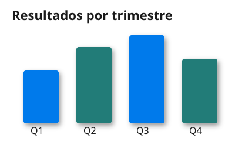

# Demo: SVG embebido

Verificación manual del soporte de imágenes SVG en el render a PDF. Arrastra
**la carpeta `svg-demo/`** (no el `.md` suelto) en el modo por lotes de la web
app para que el `.svg` hermano se localice y se stagee junto al Markdown.

El siguiente SVG lleva:

- un `<style>` con clases CSS (colores y tipografía por clase),
- un filtro `feGaussianBlur` (sombra proyectada bajo las barras),
- texto (`Poppins`) que debe rasterizarse con la **tipografía de la marca**
  activa, no con una fuente de fallback.

Tras generar el PDF, el gráfico debe verse **nítido** (oversample ×3), con la
sombra del filtro y el texto en la tipografía de marca.

## SVG roto (fallback)

La siguiente referencia apunta a un SVG inexistente: debe caer en el aviso
*[imagen no disponible]* sin romper el resto del documento.

Fin del documento.
